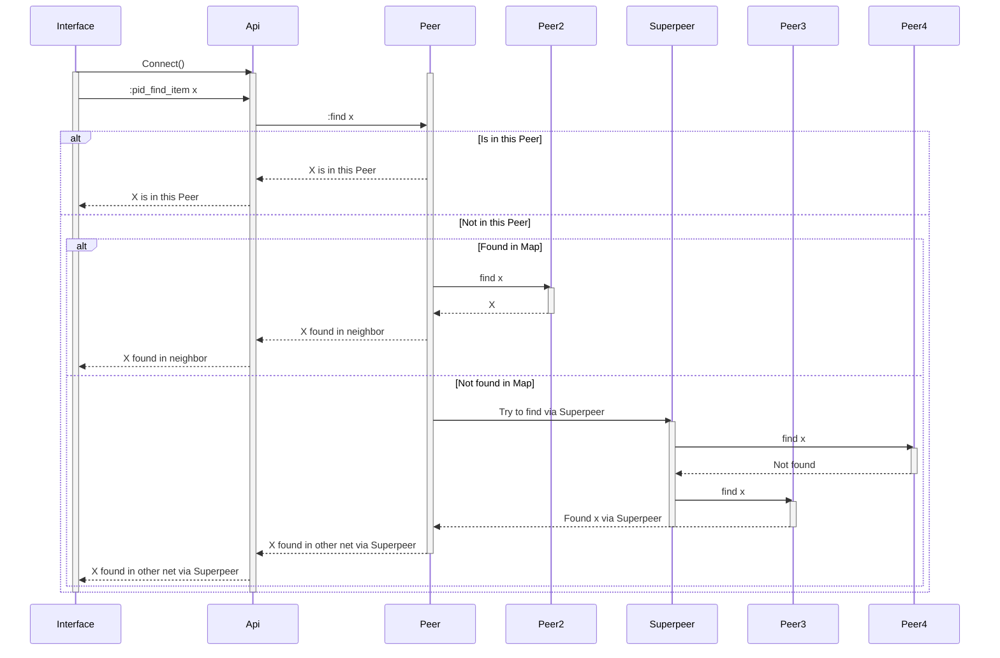

```mermaid

sequenceDiagram
    participant Interface
    participant Api
    participant Peer
    participant Peer2
    participant Superpeer
    participant Peer3
    participant Peer4

    Interface->>Api: Connect()
    activate Interface
    activate Api
    activate Peer
    Interface->>Api: :pid_find_item x
    Api->>Peer: :find x
    alt Is in this Peer
    Peer-->>Api:X is in this Peer
    Api-->>Interface: X is in this Peer
    else Not in this Peer
    alt Found in Map
        Peer->>Peer2: find x
        activate Peer2
        Peer2-->>Peer: X
        deactivate Peer2
        Peer-->>Api: X found in neighbor
        Api-->>Interface: X found in neighbor
    else Not found in Map
        
        Peer->>Superpeer: Try to find via Superpeer
        activate Superpeer
        Superpeer->>Peer4: find x
        activate Peer4
        Peer4-->>Superpeer: Not found
        deactivate Peer4
        Superpeer->>Peer3: find x
        activate Peer3
        Peer3-->>Peer: Found x via Superpeer
        deactivate Peer3
        deactivate Superpeer
        Peer-->>Api: X found in other net via Superpeer
        deactivate Peer
        Api-->>Interface: X found in other net via Superpeer
    end

    end
    deactivate Interface
    deactivate Api
	
```
